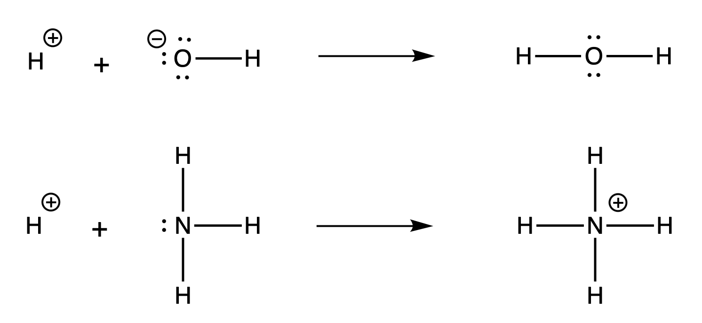
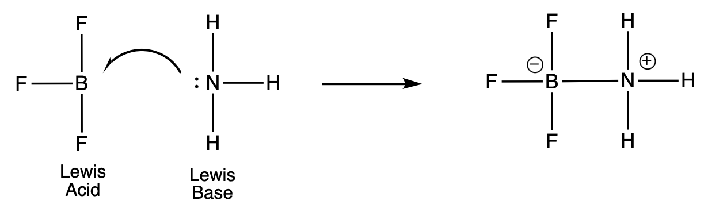

# Acid-Base Theories

There are a handful of ways one can define if a compound acts like an acid or base. This page will cover the three main acid-base theories that are commonly iscussed in chemistry (but acknolwedge that there are others).

## Arrhenius Theory

The Arrhenius definition is relatively straight forward but only apply to aqueous solutions. **Arrhenious acids** are substances that yeild H+ ions when disolved in water, and **Arrhenious bases** yeild OH- ions. Lets look at a couple of examples.

HCl(aq) is considered an Arrhenius acid because when dissolved into water, HCl dissociates into H+(aq) and Cl-(aq) ions.

NaOH(aq) is considered an Arrhenius base because when dissolved into water, NaOH dissociates into Na+(aq) and OH-(aq) ions.

### Exercise
Circle if the compound on the reactant side in the table is an Arrhenius Acid or Base.

|Compound | Arrhenius Acid/Base |
| ------- | ------------------- |
| KOH(aq) $\rightarrow$ K+(aq) + OH-(aq) | Acid  / Base |
| HNO3(aq) $\rightarrow$ H+(aq) + NO3-(aq) | Acid  / Base |
| Cu(OH)2 (aq) $\rightarrow$ Cu+(aq) + 2 OH-(aq) | Acid  / Base |

## Brønsted Theory

The Arrhenius definition helps identify many types of compunds which are acids and bases, however is limited because they only apply to aqueous solutions. A broader definition was was proposed by Johannes Brønsted in 1932 to classify a larger group of compounds as acids or bases. A **Brønsted acid** is a *proton donor* and a **Brønsted base** is a *proton acceptor*. This definition does not require acids and bases to be in aqueous solution, just that acids donate a proton and bases accept one. Lets take our HCl example above:

When we write the state of a compound, we typically write it as a solid (s), liquid (l), or gas (g). Here, our acids and bases are dissolved in water. To denote that, we say that it is in an aqueous (aq) state. In other words, in addition to having HCl as a reactant, we have water. So another way to write the reaction above is:

This reaction is more representative of what is happening in the reaction. H+ is a very reactive atom, and will want to bond with another atom. Given the presence of water, the proton will stick to the negatively charge O atom of water forming a *hydronium ion* (H3O+). This equation shows the reaction between the Brønsted acid (HCl) and Brønsted base (H2O) forming hydronium and chloride (Cl-) ions.

The hydroxide ion is classified as a Brønsted base because it can accept a base as follows:

Any Arrhenius base can be classified as a Brønsted base. However, not all Brønsted bases can be classified as an Arrhenius base. For example, ammonia (NH3) is a Brønsted base because it can accept a proton from an acid or water.

Within Brønsted acid-base theory, some compounds can act as both an acid and a base. The compounds are called *amphoteric*. For example, bicarbonate ion can both donate and accept a proton.

The top reaction corresponds to bicarbonate acting as a Brønsted acid, where the bottom shows it as a Brønsted base.

### Exercise
Classify each of the following species as Brønsted acid or base if they react with water.

|Compound | Brønsted Acid/Base/Both |
| ------- | ------------------- |
| HBr | Acid / Base / Both |
| NO3- | Acid / Base / Both |
| HCN | Acid  / Base / Both |
| H2O | Acid  / Base / Both |

## Lewis Theory

According to the Brønsted theory, a base must be able to accept protons. By this definition, both the hydroxide ion and ammonia are Brønsted bases:

In both cases, the atom which the proton becomes attached to posses at least one unshared paired of electrons. The characteristic property of OH-, NH3, and other Brønsted bases suggests a more general definition of acids and bases. In 1932, an american chemist named G. N. Lewis formulated a new definition of acids and bases. He defined a **Lewis base** as a substance that can *donate a pair of electrons* and a **Lewis acid** as a substance that can *accept* a pair of electrons*. For example the protination of NH3 acts as a Lewis base because it donates a pair of electrons to the H+, which acts as a Lewis acid. 

The Lewis definition of acids and bases is more general than the Brønsted and Arrhenius definitions. Consider the reaction between BF3 and NH3:

The vacant $p_{z}$ orbital accepts an electron pair from the NH3. BF3 functions as an acid according to the Lewis theory, even though it does not contain an ionizable proton.

### Exercise

Write the reaction of two water molecules forming a hydronium and hydroxide ion. Highlight which water is acting as the Lewis acid and which water is the Lewis base. Draw the Lewis dot diagrams and show the movement of the lone pair electrons from the Lewis acid to the Lewis base.

[Measuring the Stength of Acids and Bases >>>](./pH-lect.md)

[<<< Properties of Acids and Bases](./Properties-lect.md)

[<<< Home](./)

