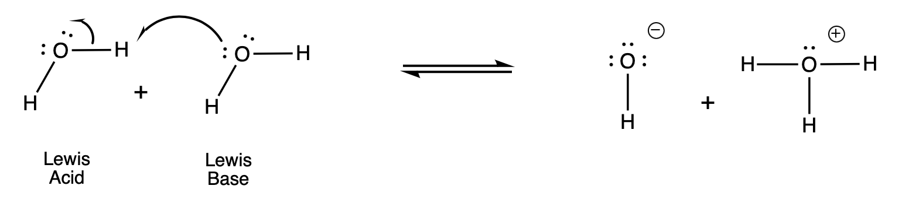

# Acid-Base Properties of Aqueous Solutions are Governed by the Autoionization of Water

In the previous section, we showed that water can act as an acid or a base depending on what its reacting with. Water is a weak electrolyte but does undergo inonization to a small extent (as demonstrated in the previous example). This reaction is sometimes known as **autoionization of water**.

The reaction above indicates that there is an equilibrium between liquid water (reactants) and the hydronium and hydroxide ions (products). There for, we can express the equilibrium constant for the autoionization of water:

$$ K_{w} = [\text{H}_{3}\text{O}^{+}][\text{OH}^{-}] $$

or

$$ K_{w} = [\text{H}^{+}][\text{OH}^{-}] $$

$K_{w}$ is known as the **ion-product constant** which is *the product of the molar concentrations of H+ and OH- ions at a particular temperature*. In pure water at $25^{\circ}$ C, the concentration of H+ and OH- are equal and found to be $[\text{H}^{+}]$ = $[\text{OH}^{-}]$ = $1.0 \times 10^{-7} M $. This means that $K_{w}$ is:

$$ K_{w} = [\text{H}^{+}][\text{OH}^{-}] = [1.0 \times 10^{-7}][1.0 \times 10^{-7}] = 1.0 \times 10^{-14} $$

**The value of $K_{w}$ is fixed at $25^{\circ}$C regardless is we have a pure solution of water or an aqueous solution of dissolved species.** Now given an arbitrary solution, we can now determine how acidic or basic it is.

## Measuring the Acidity or Alkalinity of a Solution

Whenever the $[\text{H}^{+}] = [\text{OH}^{-}]$, the aqueous solution is said to be neutral. In acidic solutions, there is an excess of H+ (or H3O+) ions and $[\text{H}^{+}] > [\text{OH}^{-}]$. In basic solutions, there is an excess of OH- ions and $[\text{H}^{+}] < [\text{OH}^{-}]$. In practic, we can change the $[\text{H}^{+}]$ and $[\text{OH}^{-}]$, but we cannot vary them independently. If we adjust the solutions $[\text{H}^{+}]$, the $[\text{OH}^{-}]$ *must* change to.

### Exercise

If we add an acid to a beaker of pure water such that the concentration of $[\text{H}^{+}]$ increases to $1 \times 10^{-6} M$, what is the concentration of $[\text{OH}^{-}]$?

## pH - a Measure of Acidity

We typically deal with very small concentrations of $[\text{H}^{+}]$ and $[\text{OH}^{-}]$ ions. A more practical measure of acidity (and alkalinity) is called **pH**. The **pH** of a solution is defined as the *negative logarithm (base 10) of the hydrogen ion activity*:

$$ \text{pH} = -\log([\text{H}^{+}]) $$

or 

$$ \text{pH} = -\log([\text{H}_{3}\text{O}^{+}]) $$

\[H+\] and \[H3O+\] is understood to be the numerical value of the hydrogen or hydronium concentration in mol L-1. When calculating the pH of a solution, we traditionally drop the units. The equation above is simpliy designed to give a convient number to work with. The negative logaritm gives us a positive number for pH. Like the equilibrium constant, the pH of a silution is a dimensionless quantity. 

Because pH is simply a way to express hydrogen ion concentration, acidic and basic solution can be identified based on their pH.

| | \[H+\] | pH |
| --- | --- | --- |
| Acidic | $ > 1.00 \times 10^{-7} M$ | $> 7.00$ |
| Basic | $ < 1.00 \times 10^{-7} M$ | $< 7.00$ |
| Neutral | $ = 1.00 \times 10^{-7} M$ | $= 7.00$ |