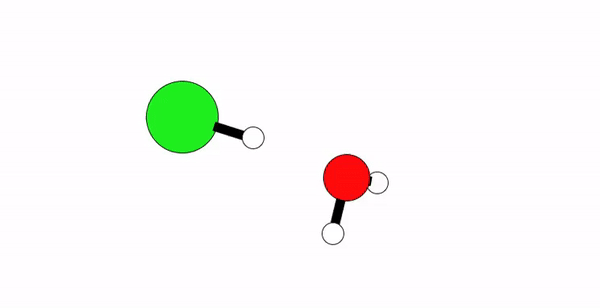

# Acid Base Theories

There are a handful of ways one can define if a compound acts like an acid or base. This page will cover the three main acid-base theories that are commonly iscussed in chemistry (but acknolwedge that there are others).

## Arrhenius Theory

The Arrhenius definition is relatively straight forward but only apply to aqueous solutions. **Arrhenious acids** are substances that yeild H+ ions when disolved in water, and **Arrhenious bases** yeild OH- ions. Lets look at a couple of examples.

$$ \text{HCl(aq)} \rightarrow \text{H}^{+}\text{(aq)} + \text{Cl}^{-}\text{(aq)} $$

HCl(aq) is considered an Arrhenius acid because when dissolved into water, HCl dissociates into H+(aq) and Cl-(aq) ions.

$$ \text{NaOH(aq)} \rightarrow \text{Na}^{+}\text{(aq)} + \text{OH}^{-}\text{(aq)} $$

NaOH(aq) is considered an Arrhenius base because when dissolved into water, NaOH dissociates into Na+(aq) and OH-(aq) ions.

### Exercise
Circle if the compound on the reactant side in the table is an Arrhenius Acid or Base.

|Compound | Arrhenius Acid/Base |
| ------- | ------------------- |
| KOH(aq) $\rightarrow$ K+(aq) + OH-(aq) | Acid  / Base |
| HNO3(aq) $\rightarrow$ H+(aq) + NO3-(aq) | Acid  / Base |
|     (aq) $\rightarrow$ Cu+(aq) + 2 OH-(aq) | Acid  / Base |

## Brønsted Theory

The Arrhenius definition helps identify many types of compunds which are acids and bases, however is limited because they only apply to aqueous solutions. A broader definition was was proposed by Johannes Brønsted in 1932 to classify a larger group of compounds as acids or bases. A **Brønsted acid** is a *proton donor* and a **Brønsted base** is a *proton acceptor*. This definition does not require acids and bases to be in aqueous solution, just that acids donate a proton and bases accept one. Lets take our HCl example above:

$$ \text{HCl}(aq) \rightarrow \text{H}^{+}(aq) + \text{Cl}^{-}(aq) $$

When we write the state of a compound, we typically write it as a solid (s), liquid (l), or gas (g). Here, our acids and bases are dissolved in water. To denote that, we say that it is in an aqueous (aq) state. In other words, in addition to having HCl as a reactant, we have water. So another way to write the reaction above is:

$$  \text{H}_{3} \text{O}^{+} (aq) + \text{Cl}^{-} (aq) $$

This reaction is more representative of what is happening in the reaction. H+ is a very reactive atom, and will want to bond with another atom. Given the presence of water, the proton will stick to the negatively charge O atom of water forming a *hydronium ion* (H3O+). This equation shows the reaction between the Brønsted acid (HCl) and Brønsted base (H2O) forming hydronium and chloride (Cl-) ions.

The hydroxide ion is classified as a Brønsted base because it can accept a base as follows:

$$ \text{H}^{+}\text{(aq)} + \text{OH}^{-}\text{(aq)} \rightarrow \text{H}_{2}\text{O(l)} $$

Any Arrhenius base can be classified as a Brønsted base. However, not all Brønsted bases can be classified as an Arrhenius base. For example, ammonia (NH3) is a Brønsted base because it can accept a proton from an acid or water.

$$ \text{NH}_{3}\text{(aq)} + \text{H}_{2} \text{O(l)} \xrightleftharpoons \text{NH}_{4}^{+}\text{(aq)} + \text{OH}^{-}\text{(aq)} $$

